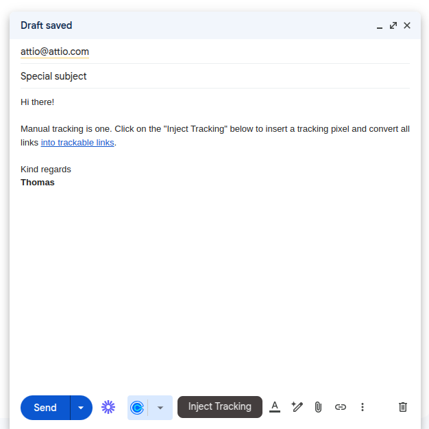
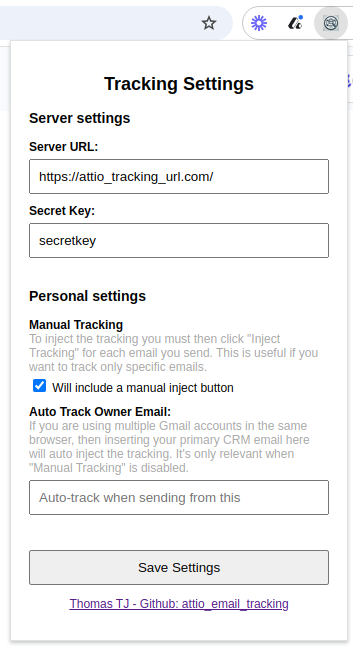

# attio_email_tracking
📧 Gmail tracking of opens and clicks for Attio CRM

**UNOFFICIAL** Gmail tracking of opens and clicks for Attio CRM. Attio supports
syncing emails, but not tracking opens and clicks.

This project is a simple server that receives webhooks from a Chrome extension and sends the data to the Attio CRM API. It allows you to see when users open your emails and click on links.

You can track data on people, companies, and deals objects in Attio.

The screenshot belows shows a manual inject tracking button, but it can also
be fully automated on both sends and schedules.





## Requirements

1. A Valkey or Redis server up and running.
2. A public endpoint to receive the webhooks.
3. An Attio API key with correct permissions (`record_permission:read-write`, `object_configuration:read`).
4. The Chrome extension loaded to send the email tracking data to the server.

## Installation

### Preparation

Download this repository to your private machine for Chrome to load the extension.

```sh
git clone git@github.com:ThomasTJdev/attio_email_tracking.git
```

Or download the zip file and extract it: [Download ZIP](https://github.com/ThomasTJdev/attio_email_tracking/archive/refs/heads/main.zip)

### Chrome extension

Your Attio CRM manager will provide you with an API key and the endpoint to send the email tracking data to.

#### Load the extension

1. Open the `manifest.json` file and replace the `https://your_host_url.com/` with your server URL.
2. Open Chrome and go to `chrome://extensions/`
3. Enable Developer mode by toggling the switch in the top right corner.
4. Click on `Load unpacked` and select the `chrome_extension` folder from this repository.
5. Reload the Gmail page.

#### Configure extension

1. Click on the extension icon in the top right corner.
2. Enter the secret key and the endpoint URL from you Attio CRM manager.


### Server

I prefer using Podman for running the server, but Docker works too.

#### Start the cache server

I like Valkey, but Redis works too.

```sh
podman pull docker.io/valkey/valkey:8.0.1
podman run -d --name valkey -p 6379:6379 docker.io/valkey/valkey:8.0.1
```

#### Start the attio_email_tracking server

Run the commands below or use the systemd service file in the repository.

**Manually**

```sh
# Set environment variables first
podman pull docker.io/thomastjdev/attio_email_tracking:latest
podman run -d --name attio_email_tracking --network host docker.io/thomastjdev/attio_email_tracking:latest
```

**Systemd**

```sh
cp attio_email_tracking.service ~/.config/systemd/user/
# Open and edit variables in the service file
nano ~/.config/systemd/user/attio_email_tracking.service
systemctl --user daemon-reload
systemctl --user start attio_email_tracking
systemctl --user enable attio_email_tracking
```

## Endpoints

```http
GET /status
Handler: handlerHealthchecksConnection

GET /healthchecks/connection
Handler: handlerHealthchecksConnection

POST /webhook/attio/email
Handler: handlerWebhookAttioEmail

GET /webhook/attio/email_opened
Handler: handlerWebhookAttioEmailOpen

GET /webhook/attio/email_clicked
Handler: handlerWebhookAttioEmailClick
```

## Environment variables

**Attribute types**
* email_opened => Text
* email_clicked => Text
* email_last_action => Timestamp

```sh
# Webserver
export WEBSERVER_HOST=0.0.0.0
export WEBSERVER_PORT=2884

# Cache redis/valkey
export REDIS_HOST=localhost

# Attio API key
export ATTIO_API_KEY=your_api_key

# Rate limit for the Attio API (1 action per 5 seconds per object type)
export ATTIO_API_RATE_LIMIT=5

# Security token for adding new emails
export ATTIO_WEBHOOK_SECRET=your_security_token

# People and Company slug for the email tracking data
export ATTIO_PEOPLE_SLUG_EMAIL_OPEN=email_opened
export ATTIO_PEOPLE_SLUG_EMAIL_CLICK=email_clicked
export ATTIO_PEOPLE_SLUG_EMAIL_LAST_ACTION=email_last_action
export ATTIO_COMPANY_SLUG_EMAIL_OPEN=email_opened
export ATTIO_COMPANY_SLUG_EMAIL_CLICK=email_clicked
export ATTIO_COMPANY_SLUG_EMAIL_LAST_ACTION=email_last_action
export ATTIO_DEAL_SLUG_EMAIL_OPEN=email_opened
export ATTIO_DEAL_SLUG_EMAIL_CLICK=email_clicked
export ATTIO_DEAL_SLUG_EMAIL_LAST_ACTION=email_last_action

# Where to send the email tracking data
export ATTIO_TRACKER_PEOPLE_ON=true
export ATTIO_TRACKER_COMPANY_ON=false
export ATTIO_TRACKER_DEAL_ON=false

# Hosting URL pointing to this server
export TRACKER_HOST_URL=https://your_host_url.com

# Email caching time in seconds (30 days are 2592000)
export EMAIL_CACHE_TIME=2592000

# If caching is expired and user clicks a link, redirect to
export EMAIL_CACHE_EXPIRED_REDIRECT=https://your_host_url.com
```

## Security

1. Only emails in the cache will be managed.
2. To add new emails, the security token must match.

## Rate limit

The general rate limit is set to 1 action per email per 5 seconds per object. This allows you to collect both people and company data for the same email while avoiding malicious API spamming.
